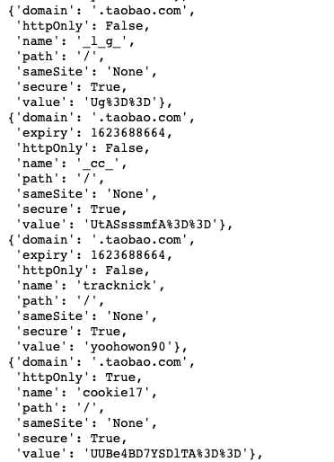
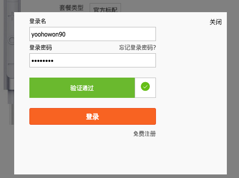
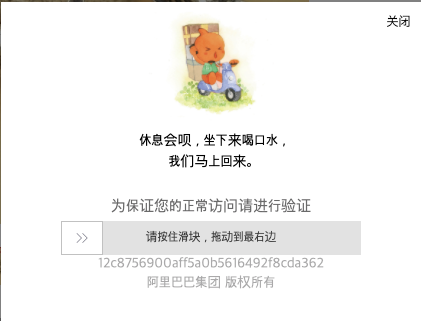

# Taabao carwler

## How to Use

```shell
$ python taobao_crawler.py item_id user_id, user_pw
```

```python
from taobao_crwler import ProductCrawler
crawler = ProductCrawler()
crawler.taobao_crawler(item_id user_id, user_pw)
```

## Goals
- 할인된 상품가격, 상품명, 옵션, 옵션이미지를 반환 하는 API 제작.

## Technical Skills
- Python, Selenium, Scrapy(TextResponse)

## Issue
- 할인된 상품가격을 제외한 나머지 정보는 Selenium을 사용하지 않고 requests를 활용해 가져올수 있음
- 할인된 상품가격은 requests로 가져오지 못함
- 티몰은 여러 종류의 할인가격인 존재
- 테스트를 위해 여러번 요청시 Block 당함

## Operation Flow
- 타오바오 & 티몰 상품 여부 확인 (최신 버전에선 삭제 - taobao의 itemId만으로 진행)
- 새로운 프록시 적용 
- 로그인 정보 입력
- 할인된 상품가격 정보 획득
- requests로 나머지 정보 획득

## Versions
- **taobao_ver1 ~ ver2** 
    - 미리 cookie를 생성해 두고, webdriver에 쿠키를 추가 하는 방식으로 할인 가격을 가져오려고 시도.

    

    - cookie값에 "expiry"가 존재 하고, api를 활용할떄 마다 새로운 쿠키를 생성해야 함


- **taobao_ver3** 
    - 로그인 정보를 직접 입력하는 방법

    

- **taobao_crawler**(최신)

```python
webdriver.ActionChains(driver).click_and_hold(swipe_btn).move_to_element_with_offset(swipe_btn,  400, 30).release().perform()```
```
  - 로그인 창에서 발생하는 swipe 액션값이 타오바오와 티몰에 동일하게 적용했을때 오류 발생
  - try & error로 최적의 값을 찾아야 할듯
  - 타오바오의 상품만 가져오도록 변경


## 한계점
  - 두 플랫폼의 상품을 모두 가져올수 있도록 해야 함

  

  - 다량의 상품을 크롤링 하려 할떄 발생함
  - 회피하는 방법 강구해야함
